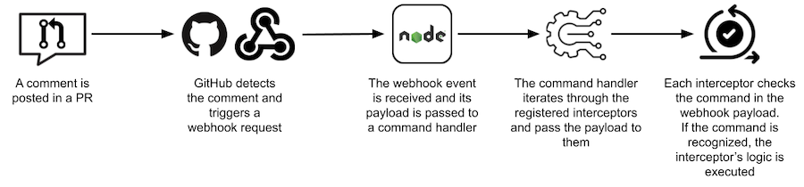
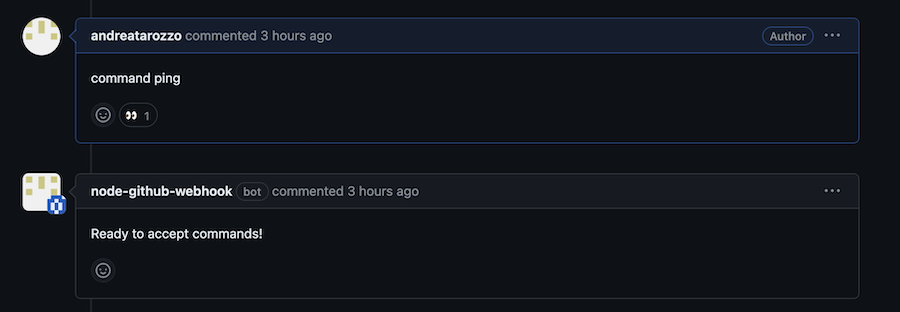
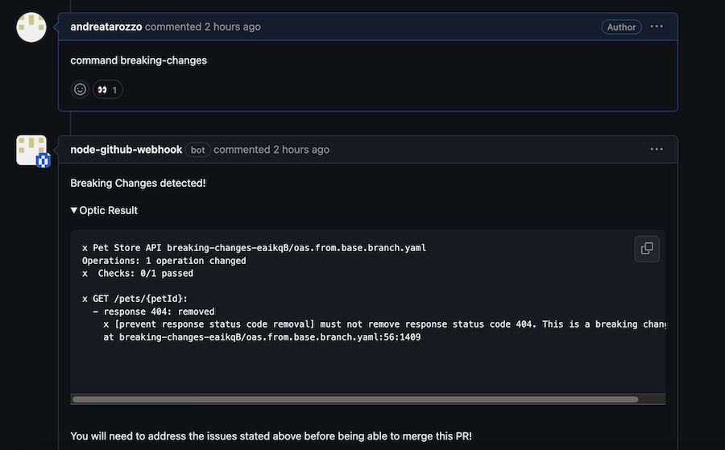
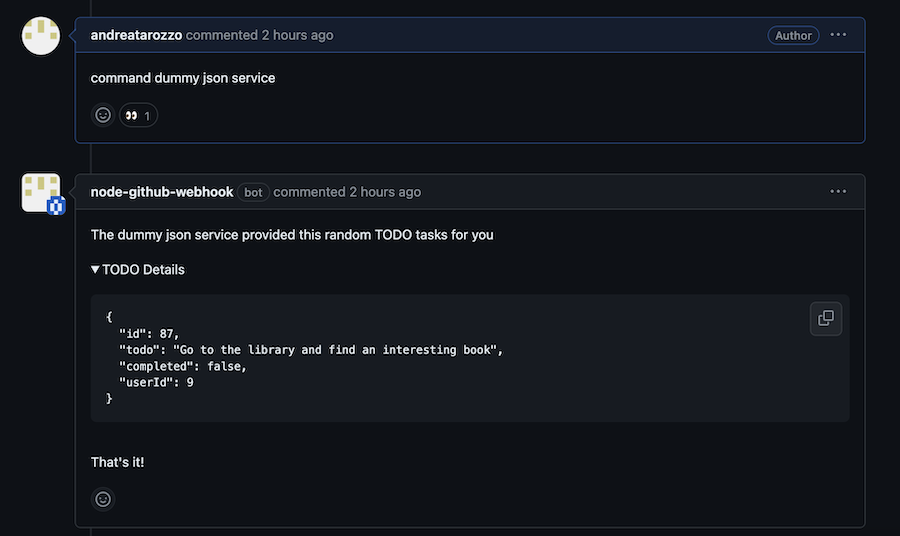
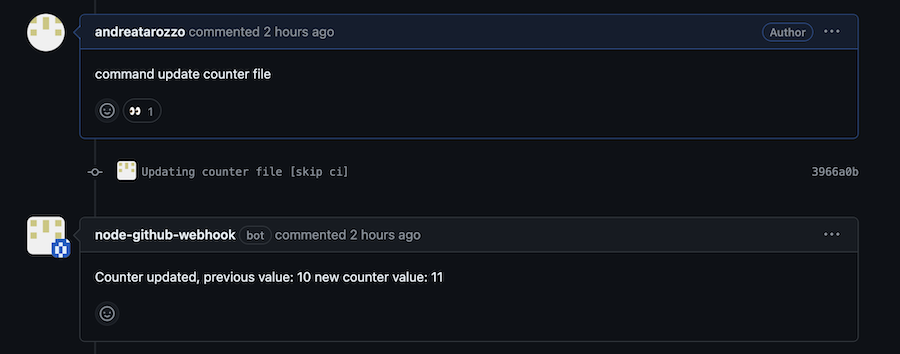
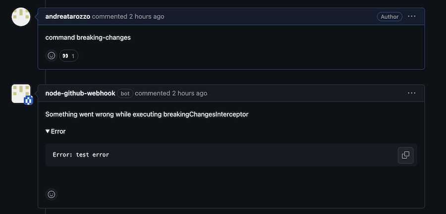

# Github Webhook Command Handler

## Introduction

This is a node webhook handler which listen for commands sent through GitHub comments and execute the logic associated to it (if any).

Although most simple operations can be handled through GitHub Actions, when it comes to more complex workflows, they may not be the best option, especially if it is necessary to interact with other services or specific setups that might not be supported or suited by Actions.

## How does it work

The current project configuration listen only for created comments posted on PRs only but it is possible to extend the behavior to any kind of event.



The interceptors present in this project are just examples to showcase some of the capabilities of a service like this one.<br>
The example interceptors currently present are the following:

- **PING INTERCEPTOR** <br>
  Command: `command ping` <br>
  Logic:

  - Acknowledge the command with a reaction attached to the comment containing the command.
  - Post a reply

  

<br>

- **BREAKING CHANGES INTERCEPTOR** <br>
  Command: `command breaking-changes` <br>
  Logic:

  - Acknowledge the command with a reaction attached to the comment containing the command.
  - Generate a temp directory that will be cleaned up at the end of the execution or if an error is thrown.
  - Fetch the required information about the branch & PR.
  - Create a `CheckRun`.
  - Clone the branch related to the PR.
  - Fetch the sample OAS file content from the base ref and generate a new file with it.
  - Run [optic](https://www.useoptic.com/) to check for breaking changes in the sample OAS file.
  - Post the result to the PR as comment failing the `CheckRun` if breaking changes are detected blocking the pr from being merged.

  

<br>

- **INTERACTION WITH DUMMY JSON SERVICE INTERCEPTOR** <br>
  Command: `command dummy json service` <br>
  Logic:

  - Acknowledge the command with a reaction attached to the comment containing the command.
  - Send a request to the [dummy json service](https://dummyjson.com/docs/todos).
  - Post the response of the service to the PR as comment.

  

<br>

- **UPDATE COUNTER FILE INTERCEPTOR** <br>
  Command: `command update counter file` <br>
  Logic:

  - Acknowledge the command with a reaction attached to the comment containing the command.
  - Generate a temp directory that will be cleaned up at the end of the execution or if an error is thrown.
  - Fetch the required information about the PR.
  - Update the branch if the PR mergeable state is not in a state of `blocked` or `clean`.
  - Fetch the required information about the branch ( checkout the comments for a more in depth explanation of why this might be required ).
  - Create a `CheckRun`.
  - Clone the branch related to the PR.
  - Check for the present of a sample counter file.
  - Create the counter file if not preset, or, updates the current one if it exists.
  - Commit the changes.
  - Push the changes.

  

<br>

- **GENERAL ERROR**: <br>
  In case something goes wrong during the execution of an interceptor a message will be posted in the PR.

  

<br>

## Setting up the necessary dependencies for the project

1. Created a GitHub App <br>
   Follow the official GitHub documentation [here](https://docs.github.com/en/apps/creating-github-apps/registering-a-github-app/registering-a-github-app)

2. Setup the webhook for your GitHub App <br>
   Follow the official GitHub documentation [here](https://docs.github.com/en/apps/creating-github-apps/registering-a-github-app/using-webhooks-with-github-apps)

3. Generate a client secret and private key for your GitHub App

4. Install your app in the target repo

5. Get the GitHub App installation ID <br>
   To get the installation ID you can either:

   - Trigger a webhook request and get it from the `installation` object attached
   - Go to the repo/org settings -> Github Apps -> Click `Configure` on your App -> Check the url of the page `https://github.com/settings/installations/<YOUR_APP_INSTALLATION_ID>`

6. Get your GitHub App user ID <br>
   To get your app user ID you can send a GET request to this endpoint or open it in the browser: <br>
   `https://api.github.com/users/<MY_GITHUB_APP_NAME>[bot]` <br>
   This will returns some information about the GitHub app ( even private ones ) including the GitHub App user id.

7. Create an `.env` file with the following information <br>

   ```
   PORT="..."
   WEBHOOK_PATH="..."
   GH_APP_ID="..."
   GH_APP_USER_ID="..."
   GH_APP_NAME="..."
   GH_APP_INSTALLATION_ID="..."
   GH_APP_CLIENT_ID="..."
   GH_APP_CLIENT_SECRET="..."
   GH_APP_WEBHOOK_SECRET="..."
   GH_APP_PRIVATE_KEY="..." ( the content of the .pem file )
   ```

   The current `Dockerfile` includes a command to copy the `.env` file into the image.<br>
   This is an ok approach for quick local development but it will create some security concern if the image is publicly available because the file will become part of the filesystem of the image's layers. <br>
   Although you might delete the file from the last layer in the Dockerfile, the file would still exist in the previous layers, potentially exposing your secrets. <br>
   If you plan to deploy this service through a CI/CD pipeline it is recommended to pass the required env variables at runtime using the `-e MY_ENV_VARIABLE=MY_VALUE` syntax alongside the `docker run` command.

### Dockerfile & Additional app/tools

If you need to use other cli tools or other apps you can install them in the dockerfile as shown for the optic installation.

<br>

## How to run the project

### Disclaimer

Because this service has to set the global `git` configuration & credentials to use the GitHub App info & token it is advised to run this service through a docker container to avoid issues with your local setup.

### Prerequisites

You need the install the Github cli app.
Follow the instruction in the official documentation [here](https://github.com/cli/cli#installation).

### Running the project

To run the project locally follow these steps:

1. Tunnel the webhook requests triggered to your local machine <br>

   ```bash
   gh webhook forward --repo=owner-login/repo-name --events=issue_comment --secret=my_super_webhook_secret_very_secret_indeed --url="http://localhost:<YOUR_PORT>/<WEBHOOK_PATH_SET_IN_ENV_FILE>"
   ```

   You will need to run the command again if, for some reason, your local server is unreachable.

2. Build the docker image
3. Run a docker container with the image previously built

### Trying the breaking changes interceptor

If you want to try out the breaking changes interceptor present in this project you will need to:

- Create a test repo / use one of your repos in which is present an OAS file.
- Adjust the breaking changes interceptor logic to point the right file
- Create a new branch in your test repo and modify the OAS file ( i.e. remove an endpoint )
- Open a PR for the new branch
- Run the command
